# 🤖 OryggiAI Database Assistant

> **Intelligent Natural Language Database Interface**
> Transform how you interact with your database - Ask questions in plain English, get instant answers.

---

## 📋 Table of Contents

1. [Overview](#-overview)
2. [Key Features](#-key-features)
3. [System Architecture](#-system-architecture)
4. [Core Components](#-core-components)
5. [Data Flow](#-data-flow)
6. [Database Architecture](#-database-architecture)
7. [API Reference](#-api-reference)
8. [Security & RBAC](#-security--rbac)
9. [Project Structure](#-project-structure)
10. [Technology Stack](#-technology-stack)

---

## 🎯 Overview

OryggiAI Database Assistant is an **AI-powered natural language interface** that enables users to query databases without writing SQL. Built as a multi-tenant SaaS platform, it combines:

- **Large Language Models (LLMs)** for understanding natural language
- **RAG (Retrieval-Augmented Generation)** for accurate SQL generation
- **Role-Based Access Control** for secure data access
- **Multi-Tool Orchestration** for complex workflows

### What It Does

| Capability | Description |
|------------|-------------|
| 🗣️ Natural Language Queries | Ask questions in plain English |
| 🔍 Intelligent SQL Generation | Auto-converts questions to optimized SQL |
| 📊 Report Generation | Create PDF/Excel reports on demand |
| 📧 Email Delivery | Send reports directly via email |
| 🔐 Role-Based Access | Users only see authorized data |
| 🏢 Multi-Tenant | Supports multiple organizations |

---

## ✨ Key Features

### 1. Natural Language Processing
```
User: "How many employees were hired last month?"
System: SELECT COUNT(*) FROM Employees WHERE HireDate >= DATEADD(month, -1, GETDATE())
Result: 47 employees
```

### 2. RAG-Enhanced SQL Generation
- Retrieves relevant schema context before generating SQL
- Uses few-shot examples for accurate query patterns
- Understands table relationships and business logic

### 3. Multi-Tool Orchestration
```
User: "Email me a PDF report of active employees in IT department"
```
**System executes:**
1. ✅ Query database for IT employees
2. ✅ Generate PDF report
3. ✅ Send via email

### 4. Enterprise Security
- JWT-based authentication
- Role hierarchy (Admin → Manager → Staff → Viewer)
- Automatic data scoping based on user role
- Complete audit logging

---

## 🏗️ System Architecture

### High-Level Architecture

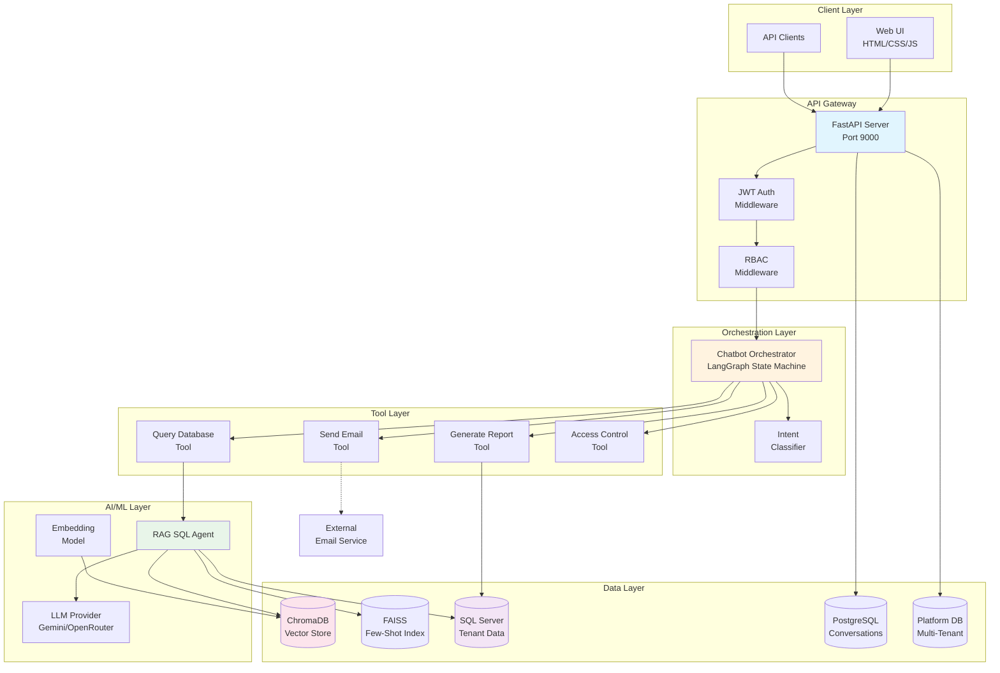

### Deployment Architecture

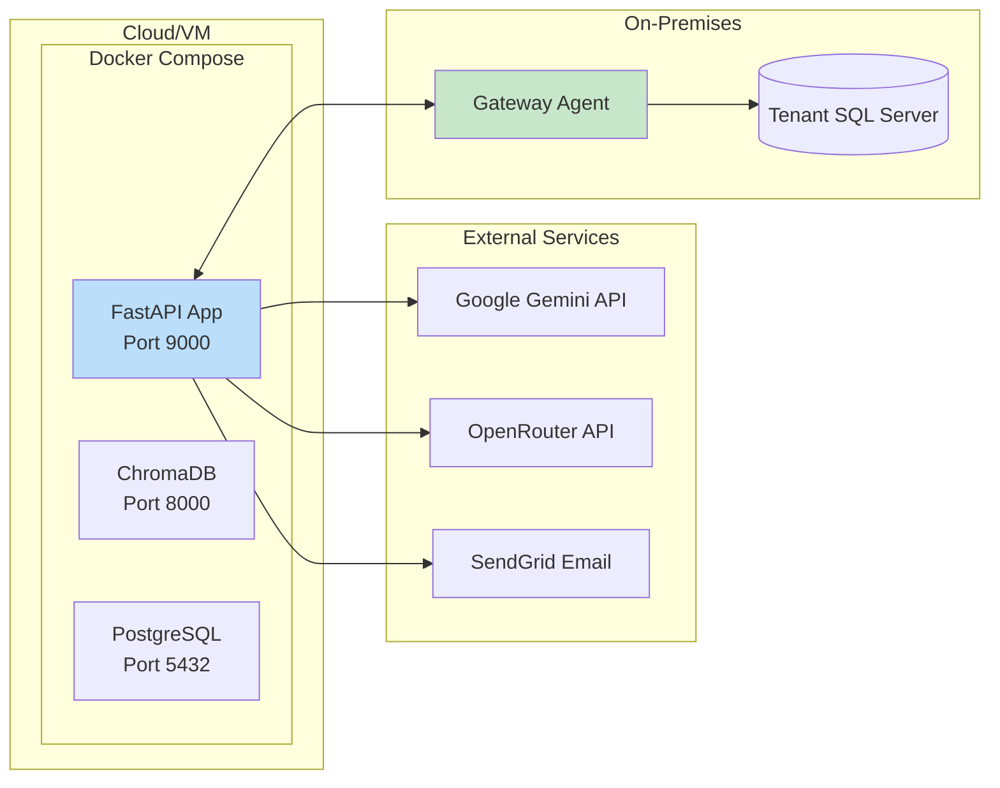

---

## 🔧 Core Components

### 1. SQL Agent with RAG

**File:** `app/agents/sql_agent.py`

The SQL Agent is the brain of query generation. It uses RAG (Retrieval-Augmented Generation) to create accurate SQL queries.

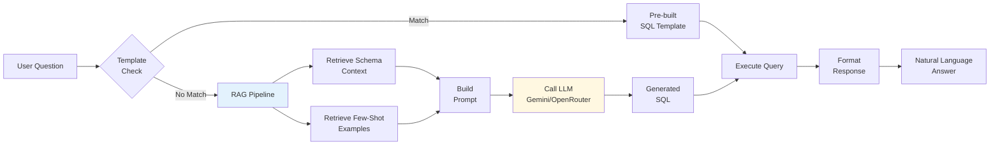

**Key Features:**
- **Template Detection:** Recognizes common query patterns (e.g., "face access")
- **Schema Context:** Retrieves relevant tables/columns from ChromaDB
- **Few-Shot Learning:** Uses similar examples from FAISS index
- **Multi-Provider:** Supports Gemini and OpenRouter LLMs

### 2. Chatbot Orchestrator (LangGraph)

**File:** `app/workflows/chatbot_orchestrator.py`

The orchestrator is a state machine that routes user requests to appropriate tools.

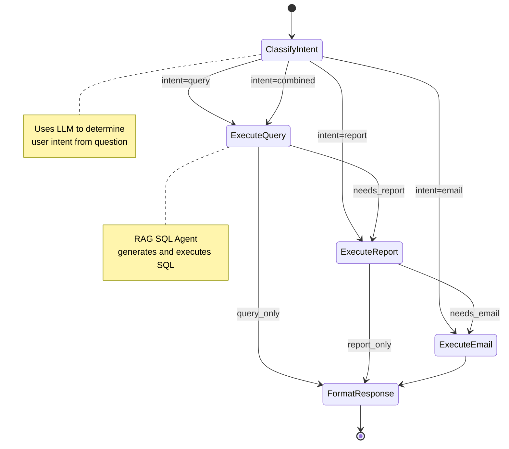

**Supported Intents:**

| Intent | Example | Tools Used |
|--------|---------|------------|
| `query` | "How many employees?" | Query Database |
| `report` | "Generate PDF report" | Query + Report |
| `email` | "Email me the report" | Query + Report + Email |
| `combined` | "Email PDF of employees" | All tools |

### 3. RAG System

The RAG system combines two vector stores for optimal retrieval:

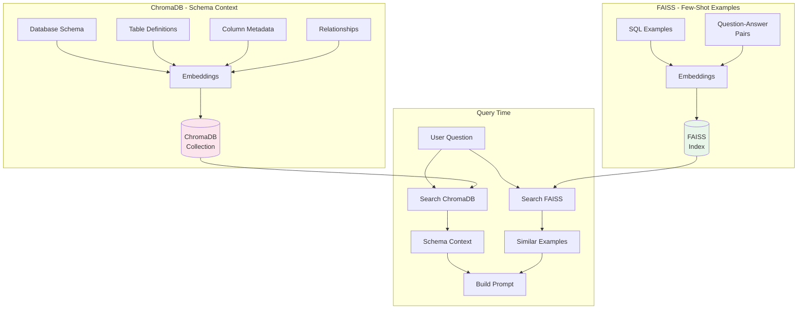

**Components:**

| Component | File | Purpose |
|-----------|------|---------|
| ChromaDB Manager | `app/rag/chroma_manager.py` | Vector store for schema |
| Schema Indexer | `app/rag/schema_indexer.py` | Index database schema |
| Few-Shot Manager | `app/rag/few_shot_manager.py` | FAISS-based example retrieval |
| Schema Enricher | `app/rag/schema_enricher.py` | Add business context |

### 4. Report Generator

**Files:** `app/reports/`, `app/tools/generate_report_tool.py`

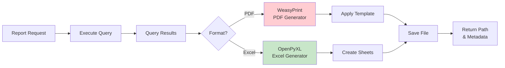

**Supported Formats:**
- **PDF:** Professional reports with headers, footers, branding
- **Excel:** Multi-sheet workbooks with formatting

### 5. Gateway System (On-Premises Integration)

**Files:** `app/gateway/`, `app/api/gateway.py`

For databases behind firewalls, the gateway system provides secure access:

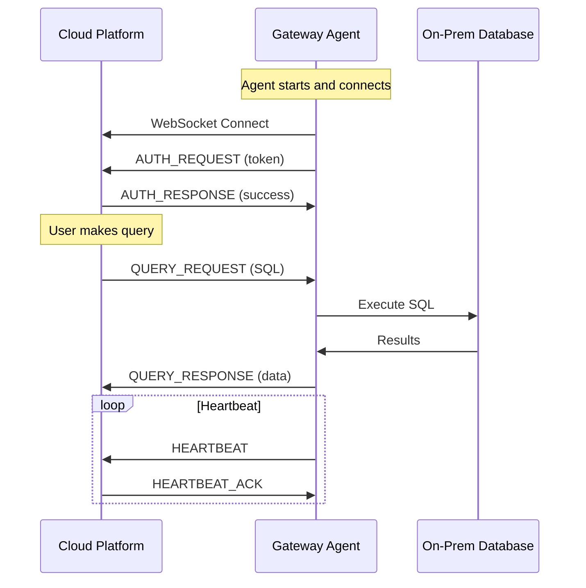

**Protocol Messages:**

| Message | Direction | Purpose |
|---------|-----------|---------|
| AUTH_REQUEST | Agent → Cloud | Authenticate gateway |
| AUTH_RESPONSE | Cloud → Agent | Return auth status |
| QUERY_REQUEST | Cloud → Agent | Send SQL to execute |
| QUERY_RESPONSE | Agent → Cloud | Return results |
| HEARTBEAT | Agent → Cloud | Keep-alive signal |

---

## 🔄 Data Flow

### Complete Query Processing Flow

```mermaid
flowchart TB
    subgraph "1. Request Reception"
        User[User] -->|Natural Language| API[/api/chat/query]
        API --> Auth{Authenticate}
        Auth -->|Invalid| Reject[401 Unauthorized]
        Auth -->|Valid| RBAC{Check Role}
    end

    subgraph "2. Intent Classification"
        RBAC --> Classify[Classify Intent]
        Classify -->|Gemini/Keywords| Intent{Intent Type}
    end

    subgraph "3. Query Execution"
        Intent -->|query| SQLAgent[SQL Agent]

        SQLAgent --> Template{Template<br/>Match?}
        Template -->|Yes| PreBuilt[Use Template SQL]
        Template -->|No| RAG[RAG Pipeline]

        RAG --> ChromaDB[(ChromaDB)]
        RAG --> FAISS[(FAISS)]
        ChromaDB --> Context[Schema Context]
        FAISS --> Examples[Few-Shot Examples]

        Context --> Prompt[Build Prompt]
        Examples --> Prompt
        Prompt --> LLM[Call LLM]
        LLM --> SQL[Generated SQL]

        PreBuilt --> Execute
        SQL --> Execute[Execute SQL]
        Execute --> Results[Query Results]
    end

    subgraph "4. Response Formatting"
        Results --> Scope[Apply Data Scoping]
        Scope --> Format[Format Response]
        Format --> Cache[Cache in Memory]
        Cache --> Response[Return Response]
    end

    subgraph "5. Report Generation (Optional)"
        Intent -->|report/combined| Report[Generate Report]
        Report --> PDF[PDF/Excel]
        PDF --> Email{Send Email?}
        Email -->|Yes| SendGrid[SendGrid/SMTP]
        Email -->|No| Download[Return File Path]
    end

    Response --> User
    Download --> User

    style SQLAgent fill:#e3f2fd
    style LLM fill:#fff8e1
    style ChromaDB fill:#fce4ec
```

### RAG Pipeline Detail

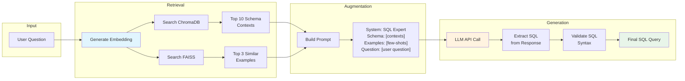

---

## 🗄️ Database Architecture

### Multi-Database Setup

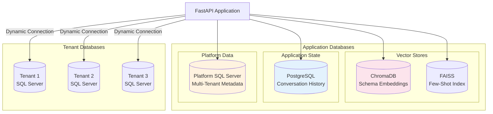

### Database Purposes

| Database | Type | Purpose | Key Tables |
|----------|------|---------|------------|
| **ChromaDB** | Vector | Schema embeddings for RAG | `database_schema` collection |
| **FAISS** | Index | Few-shot example retrieval | `few_shot_examples.json` |
| **PostgreSQL** | Relational | Conversation history | `conversations` |
| **Platform DB** | SQL Server | Multi-tenant metadata | `tenants`, `users`, `databases`, `api_keys` |
| **Tenant DB** | SQL Server | Business data (per tenant) | Employee data, etc. |

### Platform Database Schema

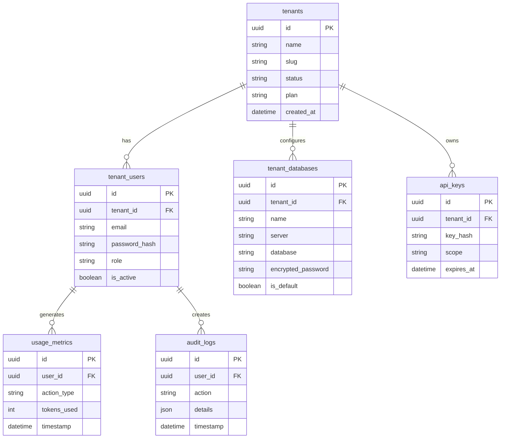

---

## 📡 API Reference

### API Endpoints Overview

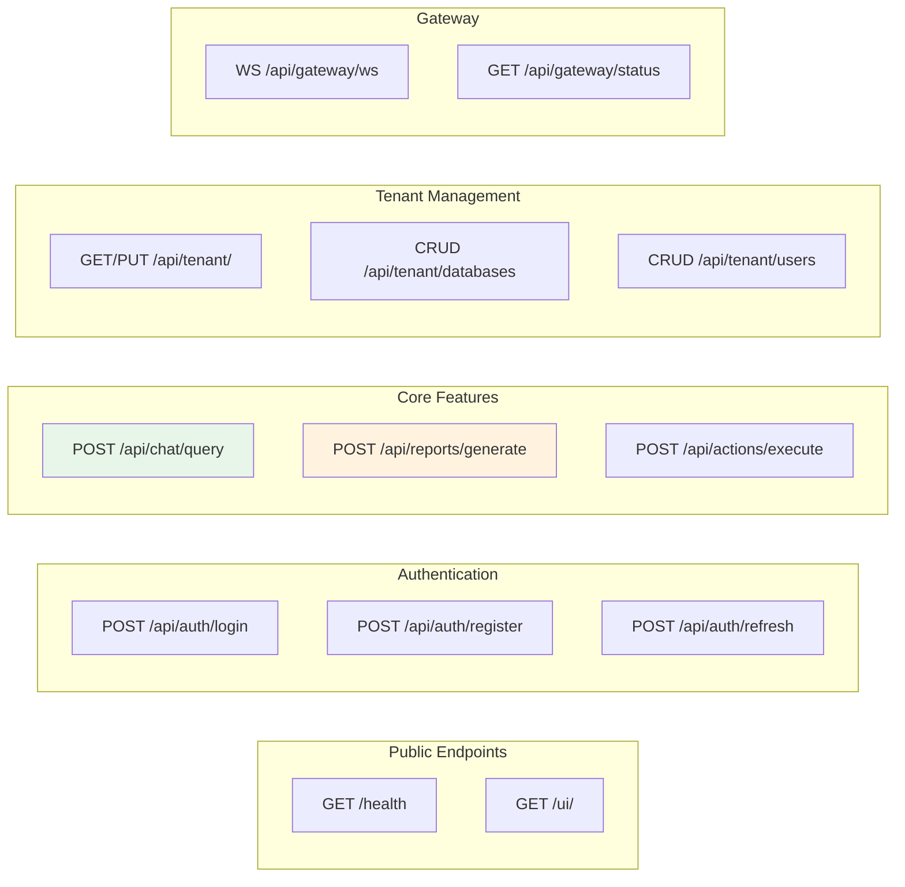

### Endpoint Details

#### Chat API

```http
POST /api/chat/query
Authorization: Bearer <token>
Content-Type: application/json

{
    "question": "How many active employees?",
    "tenant_id": "uuid",
    "user_id": "admin",
    "user_role": "ADMIN",
    "session_id": "session_xxx"
}
```

**Response:**
```json
{
    "question": "How many active employees?",
    "sql_query": "SELECT COUNT(*) FROM Employees WHERE Active = 1",
    "answer": "There are 16,560 active employees.",
    "results": [{"TotalEmployees": 16560}],
    "execution_time_seconds": 2.34,
    "tables_used": ["Employees"],
    "success": true
}
```

#### Authentication API

| Endpoint | Method | Description |
|----------|--------|-------------|
| `/api/auth/register` | POST | Register new tenant |
| `/api/auth/login` | POST | User login |
| `/api/auth/refresh` | POST | Refresh access token |
| `/api/auth/logout` | POST | Logout user |
| `/api/auth/change-password` | POST | Change password |

#### Reports API

```http
POST /api/reports/generate
Authorization: Bearer <token>

{
    "question": "List all IT department employees",
    "format": "pdf",
    "user_role": "ADMIN",
    "max_rows": 1000
}
```

#### Tenant API

| Endpoint | Method | Description |
|----------|--------|-------------|
| `/api/tenant/` | GET | Get tenant details |
| `/api/tenant/` | PUT | Update tenant |
| `/api/tenant/databases` | GET | List databases |
| `/api/tenant/databases` | POST | Add database |
| `/api/tenant/databases/{id}/test` | POST | Test connection |
| `/api/tenant/users` | GET | List users |
| `/api/tenant/users` | POST | Create user |

---

## 🔐 Security & RBAC

### Authentication Flow

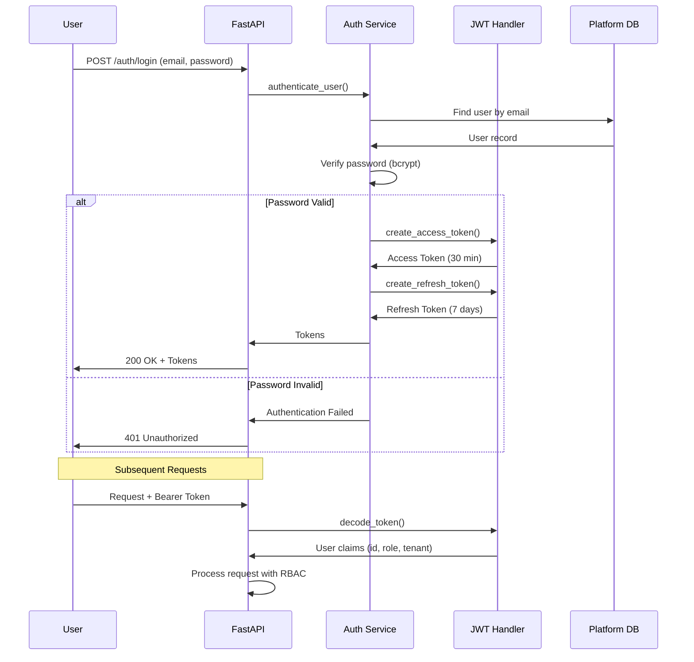

### Role Hierarchy

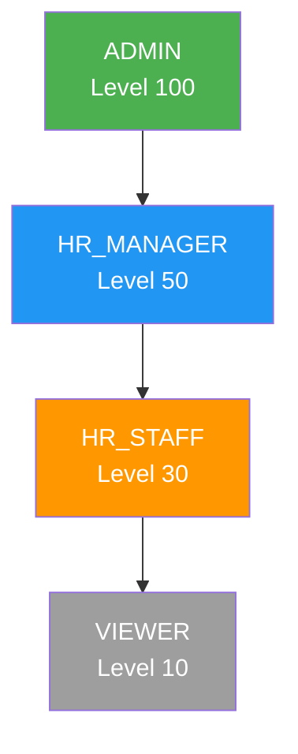

### Permission Matrix

| Role | Query DB | Reports | Email | Manage Users | Manage Tenant |
|------|:--------:|:-------:|:-----:|:------------:|:-------------:|
| ADMIN | ✅ All Data | ✅ All | ✅ | ✅ | ✅ |
| HR_MANAGER | ✅ Department | ✅ Department | ✅ | ❌ | ❌ |
| HR_STAFF | ✅ Own Data | ✅ Own | ❌ | ❌ | ❌ |
| VIEWER | ✅ Read Only | ❌ | ❌ | ❌ | ❌ |

### Data Scoping Logic

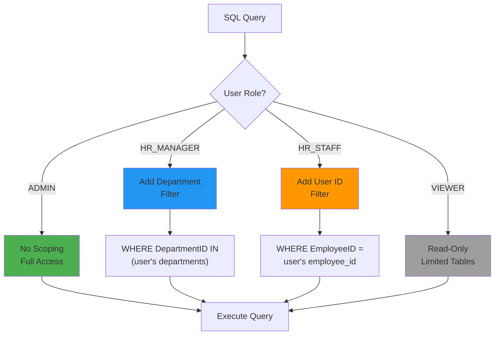

---

## 📁 Project Structure

```
OryggiAI_Service/Advance_Chatbot/
│
├── app/                              # Main application code
│   ├── main.py                       # FastAPI entry point
│   ├── config.py                     # Configuration settings
│   │
│   ├── api/                          # API endpoints
│   │   ├── chat.py                   # Chat query endpoint
│   │   ├── auth.py                   # Authentication endpoints
│   │   ├── reports.py                # Report generation
│   │   ├── tenant.py                 # Tenant management
│   │   ├── gateway.py                # Gateway WebSocket
│   │   ├── actions.py                # Action execution
│   │   └── onboarding.py             # Schema onboarding
│   │
│   ├── agents/                       # AI agents
│   │   ├── sql_agent.py              # RAG SQL Agent
│   │   └── tenant_sql_agent.py       # Tenant-specific agent
│   │
│   ├── workflows/                    # Orchestration
│   │   └── chatbot_orchestrator.py   # LangGraph workflow
│   │
│   ├── rag/                          # RAG components
│   │   ├── chroma_manager.py         # ChromaDB operations
│   │   ├── few_shot_manager.py       # FAISS few-shot
│   │   ├── schema_indexer.py         # Schema indexing
│   │   └── schema_enricher.py        # Schema enrichment
│   │
│   ├── tools/                        # Chatbot tools
│   │   ├── base_tool.py              # Abstract base class
│   │   ├── query_database_tool.py    # Database query
│   │   ├── generate_report_tool.py   # Report generation
│   │   ├── email_tools.py            # Email sending
│   │   └── access_control_tools.py   # Access management
│   │
│   ├── database/                     # Database connections
│   │   ├── connection.py             # SQL Server connection
│   │   └── platform_connection.py    # Platform DB connection
│   │
│   ├── security/                     # Security components
│   │   ├── jwt_handler.py            # JWT operations
│   │   └── encryption.py             # Encryption utilities
│   │
│   ├── middleware/                   # Request middleware
│   │   ├── rbac.py                   # Role-based access
│   │   ├── audit_logger.py           # Audit logging
│   │   └── tenant_context.py         # Tenant isolation
│   │
│   ├── memory/                       # Conversation memory
│   │   ├── conversation_store.py     # PostgreSQL storage
│   │   └── memory_retriever.py       # Memory retrieval
│   │
│   ├── gateway/                      # Gateway components
│   │   ├── connection_manager.py     # Connection tracking
│   │   ├── message_handler.py        # Message processing
│   │   └── query_router.py           # Query routing
│   │
│   ├── models/                       # Pydantic models
│   │   ├── chat.py                   # Chat schemas
│   │   ├── reports.py                # Report schemas
│   │   └── platform/                 # Platform models
│   │
│   ├── reports/                      # Report generators
│   │   ├── generator_factory.py      # Factory pattern
│   │   └── templates/                # Report templates
│   │
│   └── services/                     # Business services
│       ├── auth_service.py           # Authentication
│       └── auto_onboarding/          # Auto-onboarding
│
├── frontend/                         # Web UI
│   ├── index.html                    # Main dashboard
│   ├── style.css                     # Styles
│   └── tenant/                       # Tenant pages
│       ├── login.html
│       ├── register.html
│       ├── chat.html
│       └── dashboard.html
│
├── data/                             # Data storage
│   ├── chroma_db/                    # ChromaDB persistence
│   └── few_shot_examples.json        # SQL examples
│
├── templates/                        # Email templates
├── tests/                            # Test suites
├── logs/                             # Application logs
├── reports_output/                   # Generated reports
│
├── requirements.txt                  # Dependencies
├── docker-compose.yml                # Docker setup
├── .env                              # Configuration
└── README.md                         # Documentation
```

---

## 🛠️ Technology Stack

### Backend Framework

| Technology | Version | Purpose |
|------------|---------|---------|
| FastAPI | 0.109.0 | Web framework |
| Uvicorn | 0.27.0 | ASGI server |
| Pydantic | 2.7.4 | Data validation |
| SQLAlchemy | 2.0.25 | ORM |

### AI/ML Stack

| Technology | Version | Purpose |
|------------|---------|---------|
| LangGraph | 0.2.50 | Workflow orchestration |
| LangChain | 0.3.20 | LLM integration |
| sentence-transformers | 3.3.1 | Embeddings |
| Google Generative AI | 0.8.3 | Gemini LLM |
| ChromaDB | 0.4.22 | Vector database |
| FAISS | 1.9.0 | Similarity search |

### Databases

| Technology | Version | Purpose |
|------------|---------|---------|
| SQL Server | 2019+ | Tenant data |
| PostgreSQL | 16 | Conversation history |
| ChromaDB | Latest | Vector embeddings |

### Security

| Technology | Version | Purpose |
|------------|---------|---------|
| python-jose | 3.3.0 | JWT tokens |
| passlib | 1.7.4 | Password hashing |
| bcrypt | 4.1.2 | Bcrypt algorithm |
| cryptography | 42.0.0 | Encryption |

### Reports & Email

| Technology | Version | Purpose |
|------------|---------|---------|
| OpenPyXL | 3.1.2 | Excel generation |
| WeasyPrint | - | PDF generation |
| SendGrid | 6.11.0 | Email delivery |
| Matplotlib | 3.8.2 | Charts |
| Pandas | 2.1.4 | Data processing |

---

## 📊 Quick Reference Diagrams

### Request Lifecycle

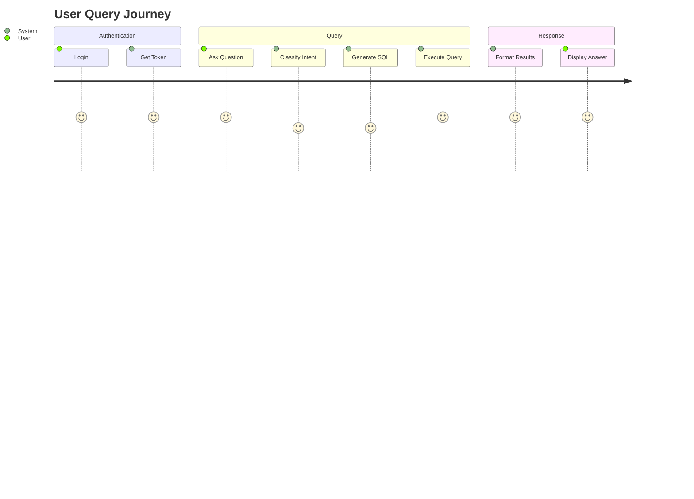

### System Components Summary

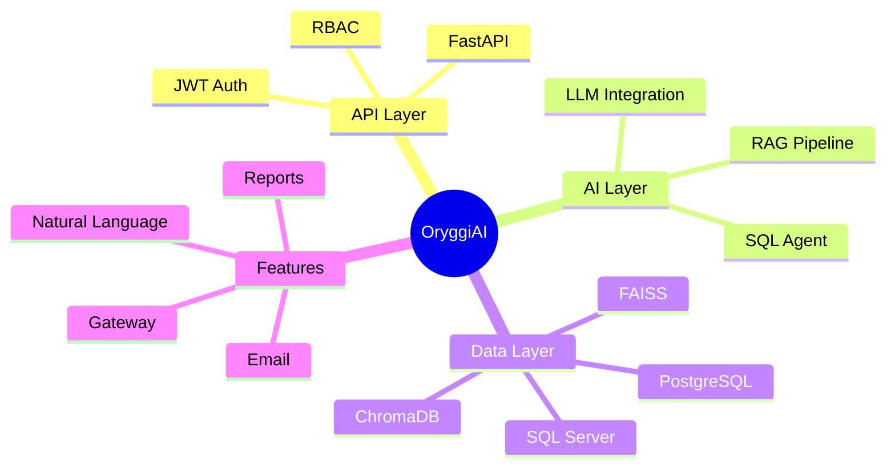

---

## 📞 Support & Resources

- **Documentation:** This file
- **API Docs:** `/docs` (Swagger UI)
- **Health Check:** `/health`
- **Logs:** `logs/oryggi_saas.log`

---

*Last Updated: December 2024*
*Version: 1.0.0*
*Built with ❤️ by OryggiAI Team*
